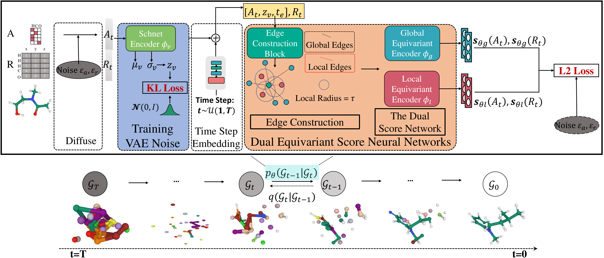

# MDM: Molecular Diffusion Model for 3D Molecule Generation



[[Paper](https://arxiv.org/abs/2209.05710)]

## Dependencies

- RDKit
- PyTorch
- Scipy
- torch-scatter
- torch-geometric

You can also clone our environment file.

```bash
# Clone the environment
conda env create -f MDM.yml
# Activate the environment
conda activate MDM
```

## Data preparation

### QM9 dataset

Download the dataset and split it.

```bash
python ./qm9/data/prepare/download.py
```

### Geom dataset

1. Download the file at https://dataverse.harvard.edu/file.xhtml?fileId=4360331&version=2.0   (Warning: 50gb):
   `wget https://dataverse.harvard.edu/api/access/datafile/4360331`

2. Untar it and move it to data/geom/
   `tar -xzvf 4360331`
3. `pip install msgpack`
4. `python3 build_geom_dataset.py --conformations 1`

## Training

### QM9 dataset

```bash
python train.py --config './configs/qm9_full_epoch.yml'
```

### Geom dataset

```bash
python train.py --config './configs/geom_full.yml'
```

## Sampling and evaluation

```bash
python test_eval.py --ckpt <checkpoint> --sampling_type <sampling type> --w_global_pos 1 -- w_global_node 1 --w_local_pos 4 --w_local_node 5
```

## Citation

```
@article{huang2022mdm,
  title={MDM: Molecular Diffusion Model for 3D Molecule Generation},
  author={Huang, Lei and Zhang, Hengtong and Xu, Tingyang and Wong, Ka-Chun},
  journal={arXiv preprint arXiv:2209.05710},
  year={2022}
}
```